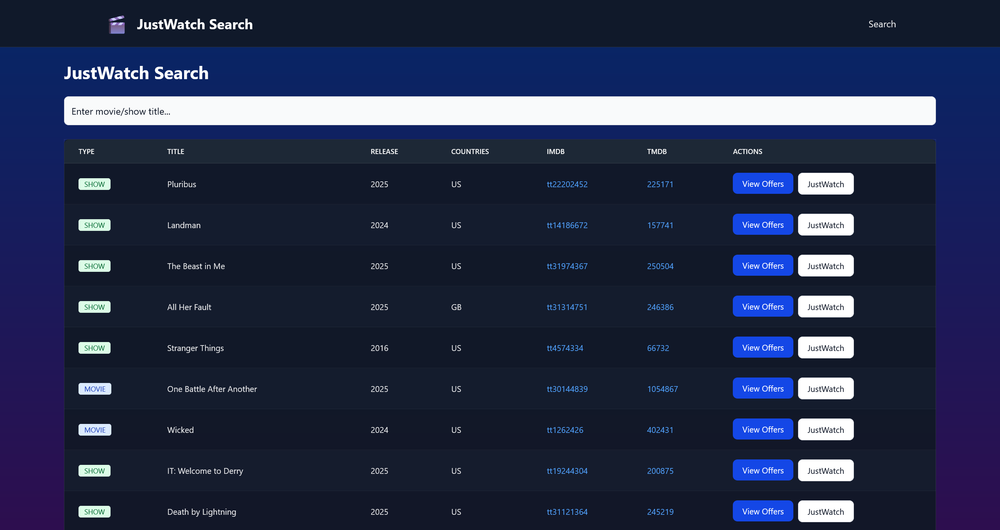
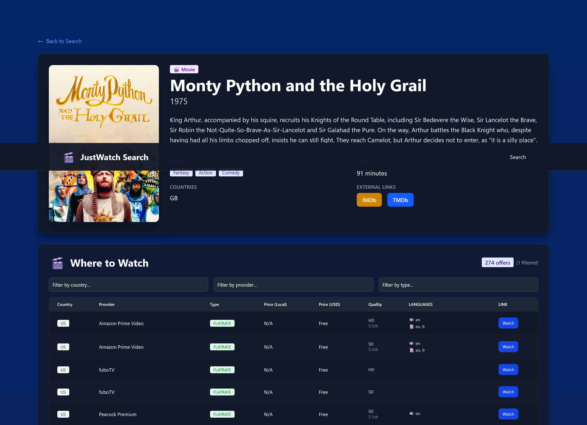

# JustWatch Search

A full-stack application for searching movies and TV shows and finding where to stream them across multiple countries using the JustWatch API.

**Screenshots**
<details>
	<summary>Click to view screenshots</summary>

  
   ### Search Page
	
   ### Title Details Page
	

</details>

## Features

- 🔍 Search for movies and TV shows
- 🌍 View streaming offers across 30+ countries
- 💰 Compare prices with automatic USD conversion
- 🎬 Detailed information including genres, runtime, ratings
- 🎨 Modern UI with dark mode
- 📊 Sortable and filterable offers table
- 🔗 Direct links to streaming platforms

## Tech Stack

### Backend
- **FastAPI** - Modern Python web framework
- **uv** - Fast Python package manager
- **httpx** - Async HTTP client
- **Pydantic** - Data validation

### Frontend
- **SvelteKit** - Web framework
- **TypeScript** - Type safety
- **Flowbite** - UI components
- **Vite** - Build tool
- **pnpm** - Package manager

## Quick Start

### Using Docker Compose (Recommended)

```bash
# Start the application
docker-compose up -d

# Access the application at http://localhost:8000
# API Docs: http://localhost:8000/docs
```

### Manual Setup

#### Backend

```bash
cd backend

# Install uv if not already installed
curl -LsSf https://astral.sh/uv/install.sh | sh

# Create virtual environment and install dependencies
uv venv
source .venv/bin/activate
uv pip install -r pyproject.toml

# Run the server
uv run fastapi dev main.py
```

The API will be available at `http://localhost:8000`

#### API Documentation

- Swagger UI: `http://localhost:8000/docs`
- ReDoc: `http://localhost:8000/redoc`

#### API Endpoints

- `GET /api/justwatch/search?q={query}&country={country}` - Search for titles
- `GET /api/justwatch/title/{node_id}` - Get title details
- `GET /api/justwatch/offers/{node_id}?path={path}` - Get offers for a title
- `GET /api/justwatch/locales?path={path}` - Get available locales


## Frontend (SvelteKit)

```bash
cd frontend

# Install pnpm if not already installed
npm install -g pnpm

# Install dependencies
pnpm install

# Run the dev server
pnpm dev
```

The app will be available at `http://localhost:5173`

### Build for Production

```bash
cd frontend
pnpm build
pnpm preview
```

## Docker Images

Pre-built Docker images are automatically published to GitHub Container Registry:

```bash
# Pull the latest image
docker pull ghcr.io/ulnanlu/justwatch:latest

# Run it
docker run -p 8000:8000 ghcr.io/ulnanlu/justwatch:latest

# Or use a specific version
docker pull ghcr.io/ulnanlu/justwatch:v1.0.0
```

## Development

### Backend Structure
```
backend/
├── main.py                 # FastAPI application
├── app/
│   ├── api/               # API routes
│   ├── models/            # Pydantic models
│   └── services/          # Business logic
└── pyproject.toml         # Dependencies
```

### Frontend Structure
```
frontend/
├── src/
│   ├── lib/
│   │   ├── api/          # API client
│   │   └── components/   # Svelte components
│   └── routes/           # SvelteKit routes
└── package.json
```

## How It Works

1. **Search**: The frontend sends search queries to the FastAPI backend
2. **GraphQL**: The backend makes GraphQL queries directly to JustWatch's API
3. **Data Processing**: Server-side processing eliminates CORS issues and handles currency conversion
4. **Display**: Results are displayed in a clean, responsive UI using Flowbite components

### Key Differences from Original

The original project used client-side requests with CORS proxies. This implementation:
- ✅ Uses server-side requests (no CORS issues)
- ✅ Implements a robust REST API with FastAPI
- ✅ Better error handling and type safety
- ✅ Docker support for easy deployment
- ✅ Automated CI/CD with GitHub Actions

## Contributing

1. Fork the repository
2. Create a feature branch
3. Make your changes
4. Submit a pull request

## License

MIT License - see LICENSE file for details
- ✅ Cleaner separation of concerns
- ✅ No dependency on third-party CORS proxies

## Technology Stack

### Backend
- **FastAPI**: Modern, fast web framework for building APIs
- **httpx**: Async HTTP client for making requests to JustWatch
- **Pydantic**: Data validation and settings management
- **uv**: Fast Python package installer and resolver

### Frontend
- **SvelteKit**: Fast, modern web framework
- **Flowbite**: Tailwind CSS component library
- **TypeScript**: Type-safe JavaScript
- **Vite**: Fast build tool and dev server

## Development Notes

- The backend requires Python 3.14+ and uses uv for package management
- The frontend uses pnpm for package management
- Both services must be running for the application to work
- CORS is configured to allow requests from the Vite dev server

## Credits

Original concept from [JustWatch-Search](https://github.com/CuSZcXJWGrzbnE/JustWatch-Search) - reimplemented with a proper backend/frontend architecture.
